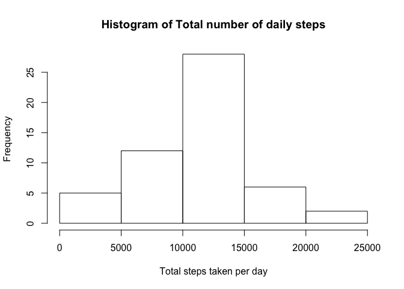
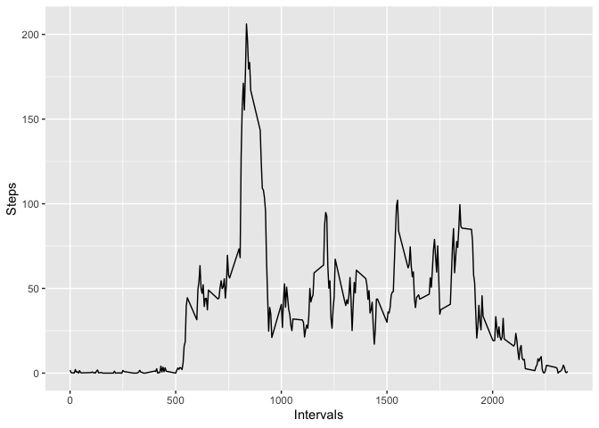
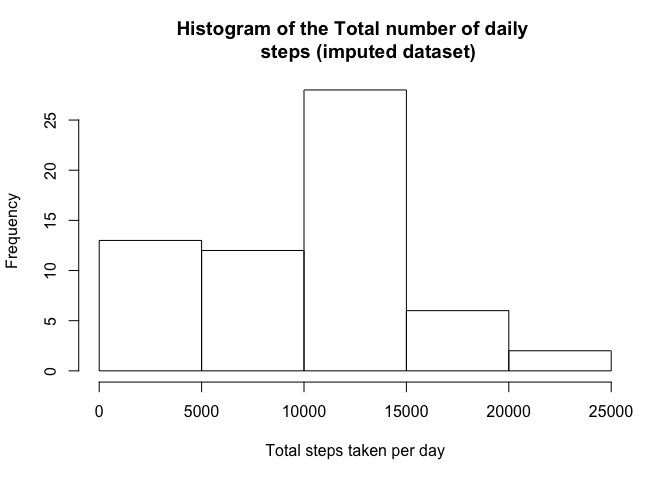
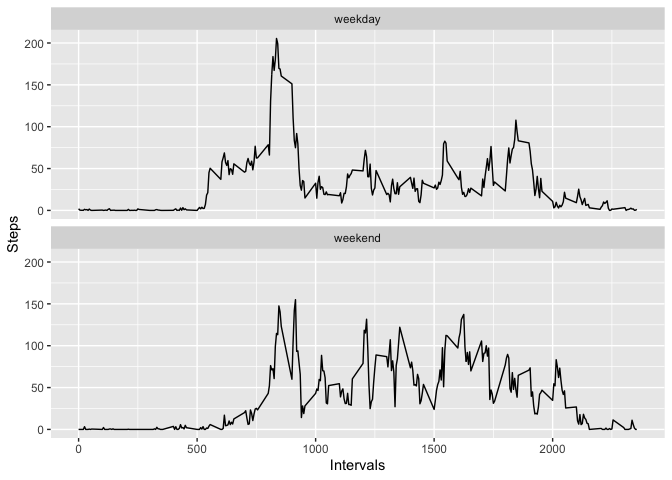

```r
#libraries

library(ggplot2)
```


## Loading and preprocessing the data


Check: the data has the said number of rows (and columns) - 


```r
##Loading the data (i.e. read.csv())
##Process/transform the data (if necessary) into a format suitable for your analysis

#input path
input.file = '/Users/samarthts/Documents/scripts_R/R_git/Repro_res/RepData_assignment_STS/RepData_PeerAssessment1/'

#input file and path 
inp = read.csv(paste0(input.file,'activity.csv' ), header = T,as.is = T)

#check dimensions to confirm number of rows
dim(inp)
```

```
## [1] 17568     3
```


## What is mean total number of steps taken per day?


```r
#For this part of the assignment, you can ignore the missing values in the dataset.
#inp1 = inp[!is.na(inp$steps),]

total_dailysteps=aggregate(x = inp$steps,by = list(inp$date), FUN = sum)
```

- The total number of daily steps taken is represented in the following histogram - 


```r
#Make a histogram of the total number of steps taken each day
hist(total_dailysteps$x,main = 'Histogram of Total number of daily steps', 
     xlab = 'Total steps taken per day')
```

<!-- -->


```r
TD_mean = mean(total_dailysteps$x, na.rm=T)

#two decimal points only
TD_mean = format(round(TD_mean, 2), nsmall = 2)
```

- The total number of steps taken per day are 10766.19


```r
#For this part of the assignment, you can ignore the missing values in the dataset.


#median_daily_steps=aggregate(x = inp$steps,by = list(inp$date), FUN = mean)
TD_median=median(total_dailysteps$x, na.rm = T)

#two decimal points only
TD_median = format(round(TD_median, 2), nsmall = 2)
```

- The median number of steps taken per day is 10765.00 

------

## What is the average daily activity pattern?

- The average daily activity pattern is seen by the time series line plot below -


```r
#Make a time series plot (type = "l") of the 5-minute interval (x-axis) and the average number of steps taken, averaged across all days (y-axis)

#remove NAs
inp1 = inp[!is.na(inp$steps),]

mean_daily_steps_2=aggregate(x = inp1$steps,by = list(inp1$interval), FUN = mean)

#ggplot line plot 
p <- ggplot(mean_daily_steps_2, aes(x=Group.1, y=x)) +
  geom_line() + 
  xlab("Intervals") +ylab("Steps")
p
```

<!-- -->

Which 5-minute interval, on average across all the days in the dataset, contains the maximum number of steps?


```r
inty=mean_daily_steps_2$Group.1[which(mean_daily_steps_2$x == max(mean_daily_steps_2$x))]
```

- The 835th interval contains the maximum number of steps taken on average across all days in the dataset  

-----------

## Imputing missing values


```r
#Note that there are a number of days/intervals where there are missing values (coded as NA). The presence of missing days may introduce bias into some calculations or summaries of the data. Calculate and report the total number of missing values in the dataset (i.e. the total number of rows with NAs). 

len.na=sum(is.na(inp$steps))
```

- The number of missing value rows are 2304

-------

Q. Devise a strategy for filling in all of the missing values in the dataset. The strategy does not need to be sophisticated. For example, you could use the mean/median for that day, or the mean for that 5-minute interval, etc.

Q. Create a new dataset that is equal to the original dataset but with the missing data filled in.

-------

The strategy to fill in missing values 

STRATEGY - Impute median step counts taken across all days  for each missing 5 minute interval. 

Top 5 lines of the new dataset below -


```r
#Devise a strategy for filling in all of the missing values in the dataset. The strategy does not need to be sophisticated. For example, you could use the mean/median for that day, or the mean for that 5-minute interval, etc. Create a new dataset that is equal to the original dataset but with the missing data filled in.

#STRATEGY - median step count across all days for that particular missing 5 minute interval 

#inp1 = inp[!is.na(inp$steps),]

median_daily_steps_2=aggregate(x = inp1$steps,by = list(inp1$interval), 
                               FUN = median)

inp_missing=inp[is.na(inp$steps),]

#change names to merge
names(median_daily_steps_2) = c('interval','steps')

#merge 
inp_miss_imputed=merge(inp_missing, median_daily_steps_2,by = 'interval', 
                       all.x = T)

new_inp_imputed=inp_miss_imputed[c(4,3,1)]

names(new_inp_imputed) = names(inp)

# rbind both dataframes and this gives us new dataset with imputed values - 

new_inp=rbind(new_inp_imputed, inp1) #NEW dataset 

#sanity check

#sum(is.na(new_inp))
#dim(new_inp)

head(new_inp)
```

```
##   steps       date interval
## 1     0 2012-10-01        0
## 2     0 2012-11-30        0
## 3     0 2012-11-04        0
## 4     0 2012-11-09        0
## 5     0 2012-11-14        0
## 6     0 2012-11-10        0
```

Q. Make a histogram of the total number of steps taken each day and Calculate 
and report the mean and median total number of steps taken per day. Do these 
values differ from the estimates from the first part of the assignment? What is 
the impact of imputing missing data on the estimates of the total daily number 
of steps?


```r
#Make a histogram of the total number of steps taken each day 

total_dailysteps_imputed=aggregate(x = new_inp$steps,by = list(new_inp$date), 
                                   FUN = sum)

hist(total_dailysteps_imputed$x, main = 'Histogram of the Total number of daily 
     steps (imputed dataset)', 
     xlab = 'Total steps taken per day')
```

<!-- -->

Imputed dataset measures of central tendency - 

- The new mean number of steps taken per day is 9503.87 

- The new median number of steps taken per day is 10395.00 

Q. Do these values differ from the estimates from the first part of 
the assignment? 

- Yes. The mean and median values are lowered in the imputed dataset.

Q. What is the impact of imputing missing data on the estimates of the total 
daily number of steps?

- Fewer daily steps taken and left-skewed histogram in the imputed datasets  

- More intervals with low frequency daily step counts because many imputed values had zeroes.

--------

## Are there differences in activity patterns between weekdays and weekends?

- Yes,there are activity differences as seen in the panel plots below:


```r
#For this part the weekdays() function may be of some help here. Use the dataset 
#with the filled-in missing values for this part.
#new_inp

#Create a new factor variable in the dataset with two levels -- "weekday" and "weekend" indicating whether a given date is a weekday or weekend day.

new_inp$week_factor = weekdays(as.Date(new_inp$date))

#create factor 
new_inp$weekday_or_end = factor('weekday', levels = c('weekday', 'weekend'))

#logical to add column
new_inp$weekday_or_end[new_inp$week_factor == 'Sunday'| 
                               new_inp$week_factor == 'Saturday'] = 'weekend'


#create factor 
#new_inp$weekday_or_end =  as.factor(new_inp$weekday_or_end)
```

### Panel plot of total daily steps taken

The panel plots are divided into weekdays and weekends 


```r
#Make a panel plot containing a time series plot (i.e. type = "l") of the 5-minute interval (x-axis) and the average number of steps taken, averaged across all weekday days or weekend days (y-axis). The plot should look something like the following, which was created using simulated data:

mean_daily_steps_3=aggregate(x =new_inp$steps,by = list(new_inp$interval,
                                                        new_inp$weekday_or_end),FUN = mean)

##ggplot panel plot
p1 <- ggplot(mean_daily_steps_3, aes(x=Group.1, y=x,)) +
  geom_line() + 
  xlab("Intervals") +ylab("Steps")

p1+ facet_wrap( ~Group.2, nrow = 2)
```

<!-- -->
